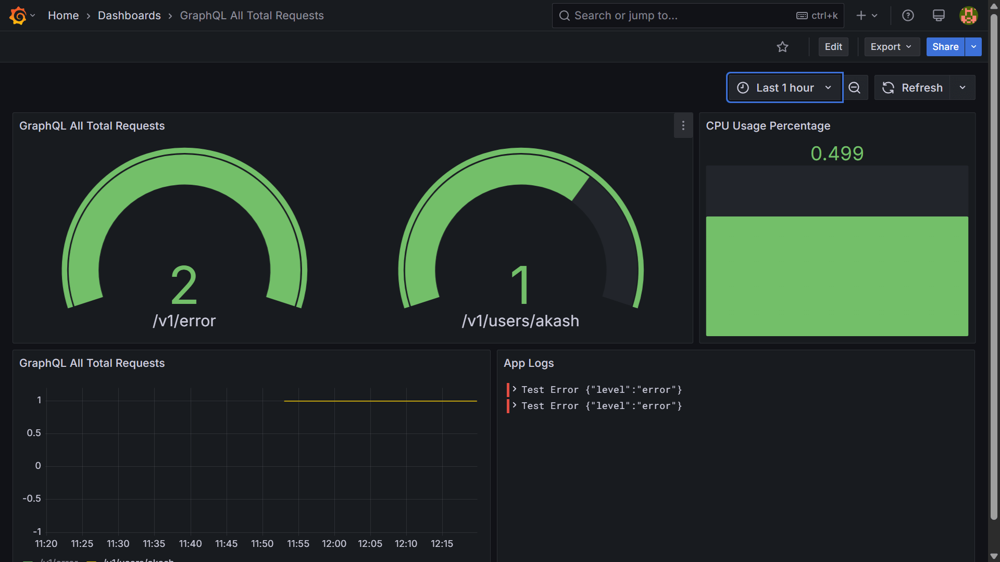

<p align="center">
  <a href="http://nestjs.com/" target="blank"></a>
</p>

# Snaapio Server

Snaapio Server is a scalable and efficient backend server built using the [NestJS](https://nestjs.com/) framework. It is designed to handle high traffic, provide robust APIs, and integrate with various services like Prometheus, Loki, and Supabase.

## Features

- **GraphQL and REST APIs**: Supports both GraphQL and REST endpoints for flexibility.
- **Authentication**: JWT-based authentication for secure access.
- **Monitoring**: Integrated with Prometheus and Grafana for metrics and Loki for log aggregation.
- **Database**: Uses PostgreSQL as the primary database with Drizzle ORM.
- **File Uploads**: Supports file uploads using Fastify Multipart.
- **Load Testing**: Includes k6 scripts for REST and GraphQL load testing.
- **Dockerized Deployment**: Docker and Docker Compose support for easy deployment.
- **Horizontal Scaling**: Kubernetes configurations for scaling and deployment.

## Architecture

- **Framework**: NestJS with Fastify adapter for high performance.
- **Database**: PostgreSQL with Drizzle ORM for schema management and migrations.
- **Caching**: Redis for caching and session management.
- **Monitoring**: Prometheus for metrics, Grafana for visualization, and Loki for log aggregation.
- **Authentication**: JWT-based authentication with Passport.js.
- **File Storage**: Supabase for file storage and management.

## Installation

### Prerequisites

- Node.js >= 18.18.0
- Docker and Docker Compose
- PostgreSQL and Redis instances

### Steps

1. Clone the repository:
   ```bash
   git clone https://github.com/akashmondal0/snaapio-server.git
   cd snaapio-server
   ```

2. Install dependencies:
   ```bash
   npm install
   ```

3. Set up environment variables:
   - Copy the `.env` file and update the values as needed:
     ```bash
     cp .env.example .env
     ```

4. Build the application:
   ```bash
   npm run build
   ```

5. Start the server:
   ```bash
   npm run start
   ```

## Running the App

### Development Mode

```bash
npm run dev
```

### Production Mode

```bash
npm run start:prod
```

### Docker Deployment

1. Build the Docker image:
   ```bash
   npm run docker:build
   ```

2. Run the Docker container:
   ```bash
   npm run docker:run
   ```

3. Alternatively, use Docker Compose:
   ```bash
   docker-compose up -d
   ```


## Monitoring and Logging

<p align="center">
  <a href="http://nestjs.com/" target="blank"></a>
</p>

- **Prometheus**: Metrics are exposed at `/v1/metrics`.
- **Grafana**: Access Grafana at `http://localhost:3000` (default admin password: `admin`).
- **Loki**: Logs are aggregated and stored using Loki.

## Load Testing

### REST API Load Testing

Run the k6 script for REST API:
```bash
k6 run ./k6-scripts/k6-rest.ts
```

### GraphQL API Load Testing

Run the k6 script for GraphQL API:
```bash
k6 run ./k6-scripts/k6-graphql.ts
```

## Environment Variables

Key | Description
--- | ---
`JWT_SECRET` | Secret key for JWT authentication
`PG_URL` | PostgreSQL connection URL
`REDIS_URL` | Redis connection URL
`SUPABASE_URL` | Supabase project URL
`SUPABASE_ANON_KEY` | Supabase anonymous key
`GEN_AI_API_KEY` | API key for generative AI integration
`STRIPE_PUBLISHABLE_KEY` | Stripe publishable key
`STRIPE_SECRET_KEY` | Stripe secret key
`LOKI_TRANSPORT` | Loki transport URL for logging

<!-- ## Testing

### Unit Tests

```bash
npm run test
```

### End-to-End Tests

```bash
npm run test:e2e
```

### Test Coverage

```bash
npm run test:cov
``` -->

## Deployment

### Kubernetes

1. Start the deployment:
   ```bash
   npm run deployment:start
   ```

2. Scale the deployment:
   ```bash
   npm run deployment:scale
   ```

3. Stop the deployment:
   ```bash
   npm run deployment:stop
   ```

## Stay in Touch

- **Author**: [Akash Mondal](https://github.com/akashmondal0)
- **Website**: [Portfolio](https://akashmondal0.vercel.app/)
- **Twitter**: [akashmondal_1](https://x.com/akashmondal_1)

<!-- ## License

This project is [UNLICENSED](LICENSE). -->